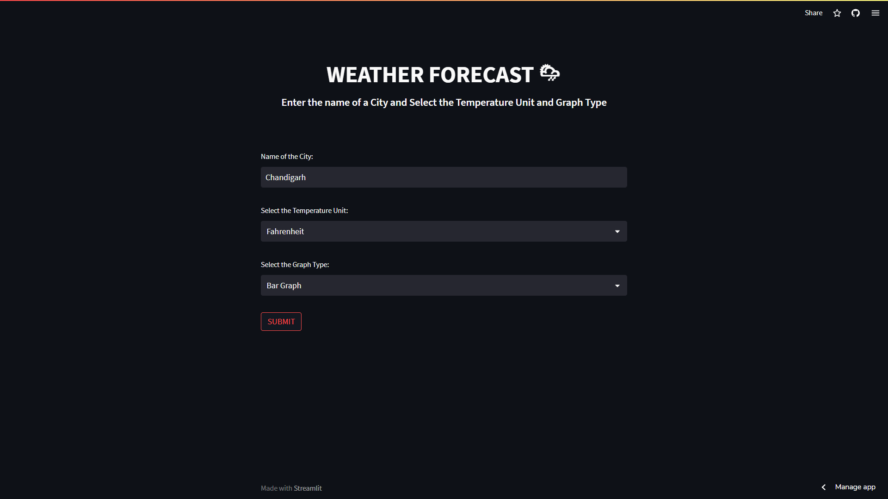

<h2 align="center">
  WEATHER APP - 
  <a href="https://himanshugalav1-weatherapp-weather-vvfpp9.streamlit.app/" target="_blank">Link</a>
</h2>

 
 

  
  <h3 align="center">Website Preview</h3>

Descriptions for the Python-based weather app:

- Python-based weather app: A weather application developed using Python programming language.
- pyOWM API integration: Utilizes the pyOWM API to fetch weather forecast data from a reliable source.
- matplotlib library for graph plotting: Integrates the matplotlib library to create line and bar graphs for visualizing weather data.
- 5-day weather forecast: Displays the weather forecast for the next five days, providing users with an overview of upcoming conditions.
- Wind speed information: Provides details about the wind speed, allowing users to plan outdoor activities accordingly.
- Sunrise and sunset times: Shows the time of sunrise and sunset for each day, helping users plan their daily activities effectively.
- Daily forecast alerts: Sends alerts to users about significant weather changes or extreme conditions, ensuring they stay informed and prepared.
- User-friendly interface: Offers an intuitive and easy-to-navigate interface for a seamless user experience.
- Weather descriptions: Provides descriptions of weather conditions (e.g., sunny, cloudy, rainy) to give users a clear understanding of the forecasted weather.
- Activity planning: Helps users plan their activities based on the forecasted weather conditions, ensuring they make informed decisions.
- Visual representation of weather trends: Utilizes line and bar graphs generated with matplotlib to visually represent weather trends over time.
- Improved comprehension: The visual graphs enhance users' understanding of forecasted conditions and facilitate quick interpretation of weather patterns.

In summary, the Python-based weather app integrates the pyOWM API and matplotlib library to offer a user-friendly interface with a 5-day weather forecast, wind speed information, sunrise and sunset times, and daily forecast alerts. It provides users with comprehensive weather details, aiding in activity planning and enhancing comprehension through visual graphs.

Contributors - 
Himanshu Galav: [https://github.com/himanshugalav1/](https://github.com/himanshugalav1)
Shreya Maheshwari: [https://github.com/shreyamaheshwari1/](https://github.com/shreyamaheshwari1)
